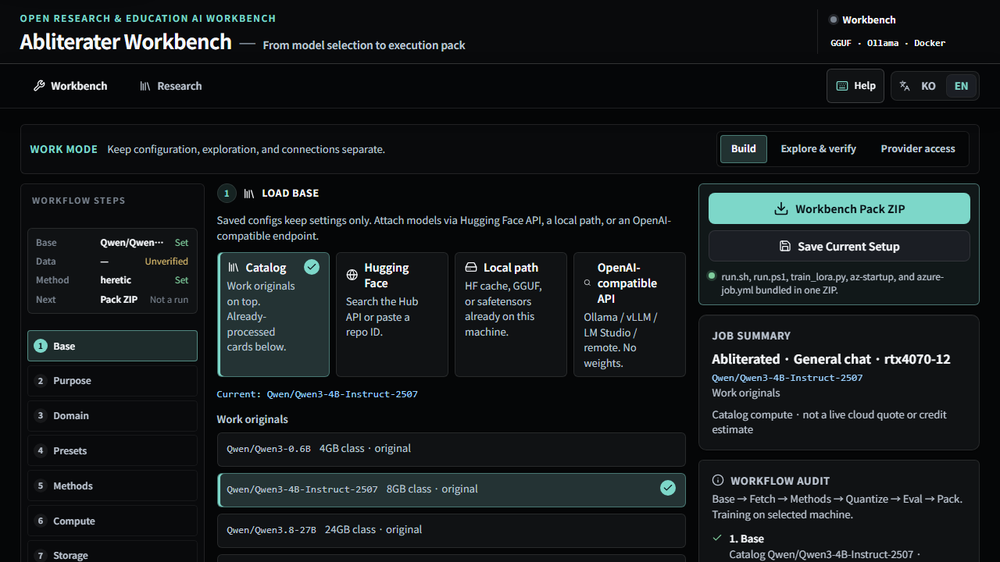

# Abliterater

**Tujuan pendidikan.** Mempelajari penekanan penolakan (*abliteration*) agar peneliti dan pertahanan dapat **menangkal penggunaan ilegal**. Tujuan itu butuh **perhatian dunia**. Ini bukan buku serangan.

English: [README.md](./README.md) · 한국어: [README.ko.md](./README.ko.md)

[](https://github.com/genoxone20261/Abliterater_public/actions/workflows/ci.yml)
[](./LICENSE.md)

**Kontribusi diterima.** **Penggunaan komersial, ilegal, dan penyalahgunaan pihak ketiga tidak dilisensikan** — [ACCEPTABLE-USE.en.md](./ACCEPTABLE-USE.en.md). PR adalah pemberian AGPL-3.0-or-later **dan** syarat tambahan itu.



## Bahasa

| Bahasa | Berkas |
| --- | --- |
| English | [README.md](./README.md) |
| 한국어 | [README.ko.md](./README.ko.md) |
| 日本語 | [README.ja.md](./README.ja.md) |
| 简体中文 | [README.zh-Hans.md](./README.zh-Hans.md) |
| 繁體中文 | [README.zh-Hant.md](./README.zh-Hant.md) |
| Español | [README.es.md](./README.es.md) |
| Français | [README.fr.md](./README.fr.md) |
| Deutsch | [README.de.md](./README.de.md) |
| Português (Brasil) | [README.pt-BR.md](./README.pt-BR.md) |
| Русский | [README.ru.md](./README.ru.md) |
| العربية | [README.ar.md](./README.ar.md) |
| Tiếng Việt | [README.vi.md](./README.vi.md) |
| Bahasa Indonesia | [README.id.md](./README.id.md) (berkas ini) |

UI aplikasi Korea/Inggris. Panduan: [USER-GUIDE.en.md](./USER-GUIDE.en.md).

## Apa yang dilakukannya

Pilih basis **Instruct yang belum di-abliterate**, susun **pack ZIP** Heretic / LoRA / kuantisasi, sambungkan kunci cloud GPU **Anda**.

| Permukaan | Peran |
| --- | --- |
| Workbench (tab `1`) | Build · Explore · Connect |
| Research (tab `2`) | Tautan arXiv dan GitHub (`target=_blank`) |

Basis bawaan: `Qwen/Qwen3-4B-Instruct-2507`. Kartu heretic/GGUF yang sudah diproses adalah **jalur guna ulang**, bukan bawaan.

## Apa yang tidak dilakukannya

Tidak menghost bobot, tidak menyewa GPU untuk Anda, tidak vendor pohon AGPL ke `src/`, tidak mengemas PDF KDP penulis, tidak menutup buku native/GPU karena `npm test` lulus. analog `:8080` ≠ native close.

## Mulai cepat

Butuh Node 24.

```bash
git clone https://github.com/genoxone20261/Abliterater_public.git
cd Abliterater_public
npm ci
npm run dev
```

`http://127.0.0.1:8080/`. `npm run typecheck && npm run lint && npm test && npm run ledger:status`

Produksi: `npm run build` lalu `HOST=0.0.0.0 PORT=8080 node scripts/built-server.mjs`. Docker: `docker compose up -d --build`. NSIS Windows bawaan tidak ditandatangani.

## Lisensi

**AGPL-3.0-or-later + syarat tambahan.** Pihak ketiga **tidak** boleh memakai secara komersial tanpa **izin tertulis** GENOX / Juno Andy Cheong (`support@genox.one`). Penggunaan ilegal dan penyalahgunaan **tidak dilisensikan**. Berbagi sumber AGPL tidak mencabut larangan.

## Berkontribusi bersama kami

Belum selesai. Web analog bisa dipakai. Electron native / GPU golden / Hub in-app tetap **OPEN**. Kirim bukti, bukan sel markdown yang dibalik. analog `npm test` ≠ native close. [CONTRIBUTING.en.md](./CONTRIBUTING.en.md).

Jangan taruh kunci, `.env`, atau dump `docs/` di git. Alat AGPL: pin-call saja.

## Status (belum selesai)

| Buku | Masih OPEN |
| --- | --- |
| 01–20 native | 02, 13, 14, 16, 18, 20 |
| R GPU | R-004, R-005 |
| R in-app Hub | R-009 |
| W | W01, W02, W06–W09, W11, W12, W14, W16 |
| C | C-002 … C-007 |

`analog IMPLEMENTED` ≠ native close. Jangan jumlahkan. `npm run ledger:status`.

## Terima kasih

**Terima kasih** kepada penulis dan pemelihara setiap repositori dan makalah yang kami pin-call atau kutip. Tidak vendor AGPL/GPL ke `src/`. Tabel: [USER-GUIDE.en.md](./USER-GUIDE.en.md#acknowledgments--repositories). p-e-w/heretic, elder-plinius/OBLITERATUS, andyrdt/refusal_direction, FailSpy, Goekdeniz-Guelmez, heterodoxin, wuwangzhang1216, AIAnytime, jwest33, josepha-mayo, nanofatdog, AUGMXNT, ggml-org/llama.cpp, jim-plus, NousResearch, ant-research, ricyoung (kutipan saja). Makalah: Arditi dkk. Makalah jailbreak akademik untuk **pertahanan dan pemahaman**, bukan buku serangan.

## Sponsor · collaboration

**Sponsor (donation)** adalah hadiah, bukan ekuitas. Binance `110474712` / BSC `0xB8c48E65D440fe7Ee0025ebD88Da3094272977F4` (hanya BSC). **Collaboration inquiry**: `support@genox.one`. Bukan penawaran sekuritas publik. [SUPPORT.en.md](./SUPPORT.en.md).

---

GENOX · Juno Andy Cheong · [support@genox.one](mailto:support@genox.one) · https://github.com/genoxone20261
